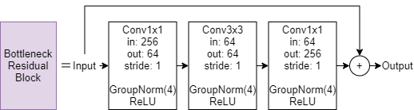

# Haze Removal Network using unified function for image dehazing

---

### Author

Hyungseok Oh, Hyena Kim, Yejin Kim, and Changhoon Yim

Department of Computer Science and Engineering, Konkuk University, Seoul, Republic of Korea

## Abstract

The atmospheric scattering model includes two crucial parameters for dehazing: global atmospheric light and the transmission map. Most previous dehazing methods need to obtain these two parameters separately, which makes dehazing a difficult and ill-posed problem. Here, a new unified function that includes both the crucial parameters for haze removal is proposed. Then the haze removal network, which now needs to learn only one function during training, is proposed. Image dehazing can be performed as a simple addition of the haze removal function with the input hazy image. Experimental results show that the proposed method gives better subjective results for indoor and outdoor synthesized images as well as natural images compared to previous state ofthe-art methods. Quantitative evaluation results show that the proposed haze removal network gives improved objective results compared with the same previous methods.

[https://doi.org/10.1049/ell2.12035](https://doi.org/10.1049/ell2.12035)

## Haze Removal Function

---

### Conventional dehazing

$I(x)=J(x)t(x)+A(1-t(x)) \\
t(x)=e^{-\beta d(x)} \\
J(x)={1 \over t(x)}I(x)-{1 \over t(x)}A+A \\
$

### Proposed method

$I=J(x)+H(x) \\
H(x)=(1-{1\over t(x)})(I(x)-A) \\
R(x)=(1-{1\over t(x)})(A-I(x)) \\
J(x)=I(x)+R(x) \\
$

## Network Architecture

---

### Overall network


### Encoder module


### Residual module



### Decoder module


---

## Dataset

The entire data set is composed of 492 images of outdoor scene data in RESIDE V0 and 1445 images of indoor scene data synthesized from the NYU Depth Dataset V2 [10]. The indoor images are synthesized according to the atmospheric scattering model using the NYU Depth Dataset, where A is randomly set between [0.6, 1.0] for each channel, and β is randomly set between [0.4, 1.6]. Among these images, 100 randomly selected images are separated as the test data for evaluation. The test data for evaluation are not used for training, and only 1837 images are used for training.

---

## Training

```jsx
python train.py
```

## Test

```jsx
python test.py
```

---

`test_analysis.py` `test_analysis_all_epoch.py` `train_analysis.py` `model_analysis.py` are analysis code